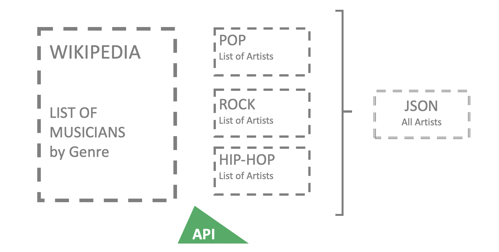
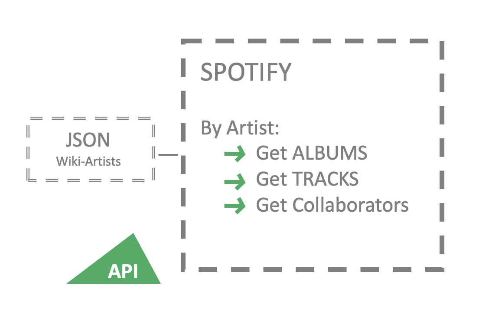

The Social graphs and interaction course (02805) focuses on access and analyse networks and user generated data. Moreover, the objectives of the course also include the application of strategies for detecting sentiment.
This website is the final result of an analysis conducted as final exam for this course.

The starting question was:

> How do artists collaborate?

It is clear that this information can be achieved by analysing all the artists who contributed to a single song.
Spotify is a music streaming service which has more than 50 millions tracks available
and they cover most music genres.
It was possible to access all these information by query its Web API.
Also, the usage of the Spotipy library facilited the downloading of the data.

Since Spotify catalouge is extremely vast, the first task was to define which subset of the artists to analysed.
A list of artists among different genres was retrieved from Wikipedia's page [_Lists of musicians_](https://en.wikipedia.org/wiki/Lists_of_musicians).
The _Wikipage_ includes a set of artists classified by genres, the final output was stored in a JSON file.

Spotify identify every artists through an unique ID. First of all, it was necessary to retrive this information.
Therefore, it is possible to retreave all the artist's discography: query all the albums and then all the included songs.

Secondly, after running several queries to the Spotify API - it was possible to build a network where each artist is a node and the edges are the detected collaborations between artists.

To conclude, a sentimental analysis has been conducted based on the lyrics of the top 5 most listened songs of each artists. The text of the lyrics was retrieved from Genius.com.

All the analysis is summarised in details in the [_Explainer Notebook_]().
The [data collected]() is public available.

The Stack:

- Deepnote
- ....
