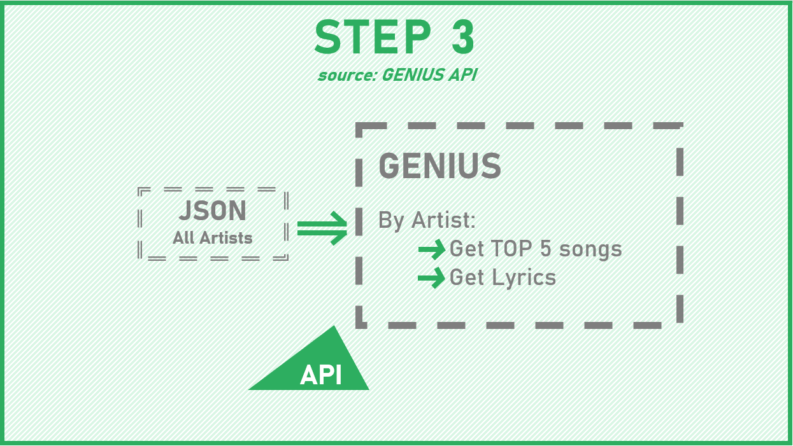

The data used for the analysis was extracted from [Spotify Web API](https://developer.spotify.com/documentation/web-api/quick-start/), [Wikipedia](https://en.wikipedia.org/wiki/Lists_of_musicians) and [Genius](https://genius.com/). To obtain and aggregate all information three main steps were followed:

The detailed analysis behind the webpage can by found in the [Explainer notebook](), and the code and the data can be found in the links below:

- Link to [github](https://github.com/andreas-kaae/socialgraphs2020_artists_collaborations_network) repository with notebooks for the analysis and data collection.
- Link to [github](https://github.com/peterampazzo/dtu-02805-website/) repostitory for the creation of the webpage.
- Link to the bulk [data]() which is not stored on github due to data limitations.

The authors of the webpage are:

- Andreas Kaae, s154395
- Silvia De Sojo, s192374
- Pietro Rampazzo, s203257
