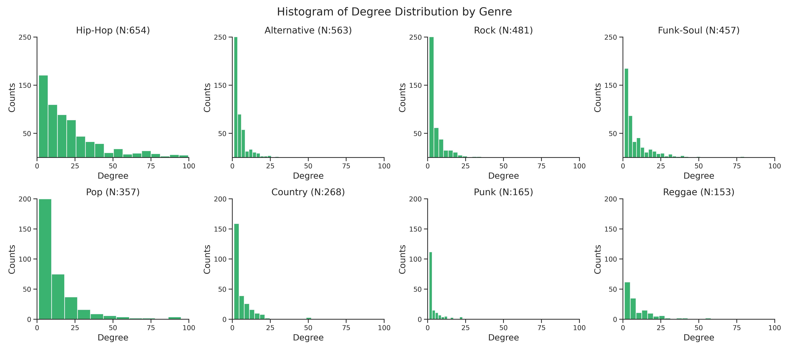

If we look at the popularity of the top 10 collaborators, it is possible to see that they all have popularity higher than 73.

More interesting is that all except one artist are from the genre _Hip-Hop_ and thus mainly rappers.
We could already make some hypothesis, will _Hip-Hop_ artists be the ones that have more collaborations?

It is as well interesting to see that only two of the most central artists, _Lil Wayne_ and _Busta Rhymes_, appear as well in the top collaborators.
Following the example used when evaluating centrality, we can conclude that _Pitbull_ is only a central element and not a part of the _kings of collaborations_,
since all the above artists have more collaborations.

## Popularity

_Are the artists that collaborate the most, the ones with the highest popularity?_
 To answer this question we first all need to establish what popularity is.
The popularity is a measure calculated by Spotify and is a value between 0 and 100, where 100 is the most popular.
For the artist, the measure is based on the popularity of all the artist's tracks, which again is based on the total number of plays and how recent these plays are.

The illustration shows a skewed distribution where most artist falls below a popularity level of 70.
It can further be noticed that no artists have lower popularity than 43.
The reason for this is that initially the amount of artists were reduced by setting the threshold at 43 as this originally was the mean of the popularity.

The most popular artists of the network are given in the table below.

| Artist        | Degree | Popularity |  Genre  |
| ------------- | :----: | :--------: | :-----: |
| Drake         |  100   |     73     | Hip-Hop |
| Juice WRLD    |   99   |     21     | Hip-Hop |
| Ariana Grande |   99   |     25     |   Pop   |
| Justin Bieber |   96   |     50     |   Pop   |
| Travis Scott  |   96   |     65     | Hip-Hop |
| The Weeknd    |   96   |     40     |   Pop   |
| Taylor Swift  |   95   |     15     |   Pop   |
| Post Malone   |   95   |     30     | Hip-Hop |
| DaBaby        |   95   |     37     | Hip-Hop |
| Eminem        |   94   |     56     | Hip-Hop |

&nbsp;

_Drake_ is the most popular artist in the network and is also very well connected with a degree of 73.
It is however interesting to see that an artist like _Taylor Swift_ only has a degree of 15 but still is among the top 10 most popular artists.
To further answer the question the popularity is plotted against the degree.

The overall correlation between the popularity and degree is 0.38, which indicates a weak relation between to two variables.
However, it is possible to observe that the nodes with the highest degree behave differently than the lowest ones. The popularity of the artists with a lower degree ranges greatly, but for the top collaborators, the popularity generally increases with the increase of degree.
This change of behaviour happens around degree 25 (indicated by a vertical grey dotted line), which is also the threshold set on the previous page that separates top collaborators from the rest.

The boxplot above shows how the popularity is distributed for the two groups.
The visualization also indicates that the popularity and level of collaboration might be related as the median for the top collaborators as well as the interquartile range is significantly higher than for the group Other Artists.
However several outliers can be seen for the Other artists, such as Taylor Swift, which have a low degree but remain very popular.

It thus appears that the level of collaboration does not strictly rely on the level of popularity of an artist.
However, it does seem that generally the artists with a higher level of popularity most likely also will have more collaborations.

## Genres

As seen previously it was found that among the top 10 collaborators most of the artists belonged to the _Hip-Hop_ genre.
The question is however if this is a general trend of simply a coincidence.
We, therefore, want to answer the question: _Do artist from certain genres collaborates more than others?_
But furthermore also if artist tends to collaborate within their genre or between genres.
Below the distribution for every genre is showed.
To make comparing the plots easier all plots are cut off at a degree of 100.

The _power-law distribution_ is maintained for all genres, but with clear differences.
The distribution for _Hip-Hop_ artists is wider, with a smaller number of artists at lower degrees compared to other genres.
Contrary, _Alternative_, _Rock_ and _Punk_ are the genres with the tightest skewed distribution.

The distribution plots thus indicate that the level of collaboration might depend on the genre.
To get a clearer view we can zoom-in on the top collaborators.

By zooming in on the top collaborators, it is possible to confirm the importance of _Hip-Hop_.
For degrees higher than 60, the other genres only appear sporadically.
However, the histogram does not take into account the unbalanced amount of artists within each genre, as previously illustrated.
To do so, we can evaluate the ratio of top collaborators by genre.
