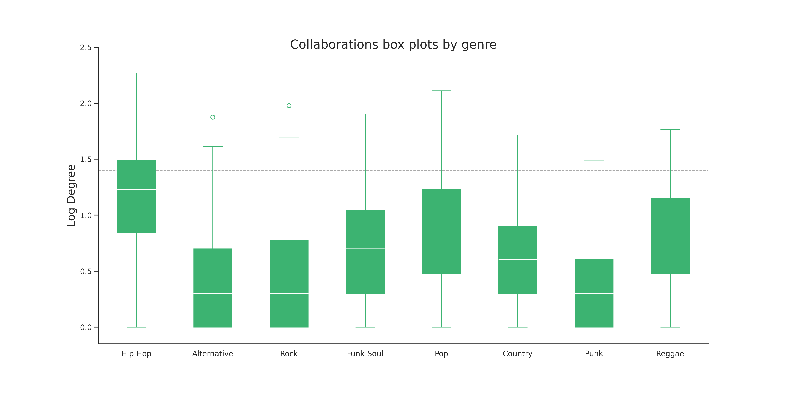

_Hip-Hop_ still holds the position with the highest ratio, as
one-third of its nodes are within the top collaborators.
There are no significant changes in the lower tier either.
_Country_, _Rock_, _Alternative_ and _Punk_ all share a substantially low ratio of top-collaborators.
We can thereby conclude that, based on our dataset,
the artist with the highest number of collaborations will tend to be _Hip-Hop_ artists.

Nevertheless, it is interesting to identify the general collaboration tendency
and how the whole set of nodes (not only the high degree nodes) behave for each genre.

By looking at the boxplot in a logarithmic scale, it allows us to visualize more clearly the differences between genres.
Additionally, the cut-off point between the top collaborators and the other artists is added as a grey dotted line.

The interquartile-range for _Hip-Hop_ artists is the only one which goes beyond the cut-off point at 25 (it reaches to a degree of 30)
and at the same time, the median is also significantly higher than for the other genres.
The third quantile of _Pop_ is the highest one after _Hip-Hop_,
however _Reggae_ reaches to almost the same value,
something we were not able to identify from the histograms.
It is as well interesting to see that the lowest medians and ranges are for the genres _Alternative_, _Rock_ and _Punk_.
Which indicates that indeed these genres will tend to have a lower number of collaborations.

As an extension to the question of whether or not the level of collaboration and genre are intertwined it is interesting
to analyse if collaborations happen within the same genre or between genres?
