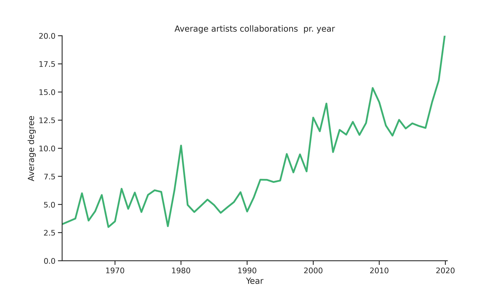

## Sentiment

_Do the artists which collaborate more make songs which are happy or sad?_ To evaluate this the sentiment of each artist is needed.
For every artist, the sentiment for each of the lyrics is calculated and the artist is assigned the average of the lyric sentiments.
However, the sentiment of each artist is only based on 3-5 song lyrics and can therefore change substantially if more or fewer songs were included.
To calculate the sentiment the lyrics are compared to a list of words from [LabMT](https://journals.plos.org/plosone/article?id=10.1371/journal.pone.0026752) which contains the sentiment score of words.
A low value indicates that the word is sad while a high value indicates that the word is considered happy.

The sentiment of artists is thus normally distributed with an average of 5.5 and a minimum sentiment of 5 and a maximum of 6.
The correlation between the sentiment and collaborations is just -0.12 which indicates that there is no relationship between the level of collaboration and the sentiment. To finally answer the question the distribution of sentiment is visualized for the top collaborators and the other artists.

The boxplot shows small differences between the groups but together with the weak correlation, this indicates that the sentiment of the lyrics are no related to how much an artist collaborates.
However, as this analysis is only carried out on a small proportion of the total number of songs for every artist the conclusion could potentially change by adding more lyrics.

It is as well interesting to see that only two of the most central artists, *Lil Wayne* and *Busta Rhymes*, appear as well in the top collaborators.
Following the example used when evaluating centrality, we can conclude that *Pitbull* is only a central element and not a part of the *kings of collaborations*,
since all the above artists have more collaborations.

As a final measure, we want to establish if the number of collaborations has changed throughout the history of time.
As the graph below shows the number of songs released has changed dramatically throughout time.
This is only including the lyrics downloaded for every artist.

The graph above resembles an exponential function. Before the 1960's not many songs are released in our dataset.
However, after this point more and more songs are released and as we get closer to 2020 the number of songs released increases exponentially.
This plot only shows the evolution of the songs in total.
To see if the pattern is similar for the different genres the visualization below is constructed.

The area plot illustrates how different genres have evolved throughout time for our subset of artists and songs.
In the 1960's most of the songs released were from the genre _Funk-Soul_ while from 1970 to 1990 _Rock_ is the dominant genre.
After 1990 the genres _Pop_, _Hip-Hop_ and _Alternative_ becomes the dominant genres.

Finally to answer the question the average degree over time is visualized below.

The graph shows that from 1960 to 2020 the average degree increases from just above 2.5 to almost 20.
The graph thus strongly indicates that the period and amount of collaborations are dependent on each other.

One of the reasons for this conclusion could come from the evolution of the music or technology which has made it easier for the artists to collaborate and to reach their audience.
However, it could also be due to the development of genres such as _Hip-Hop_ which was found to generally collaborate more with other artists.
