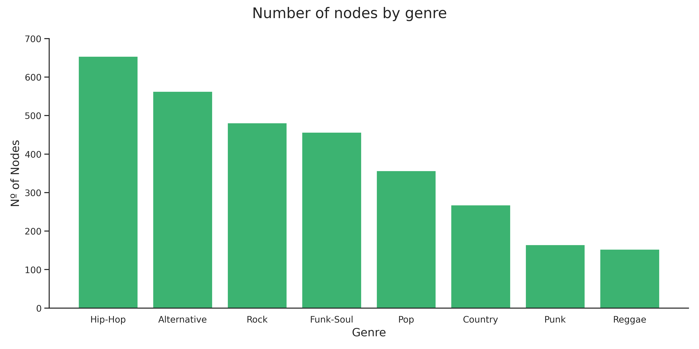
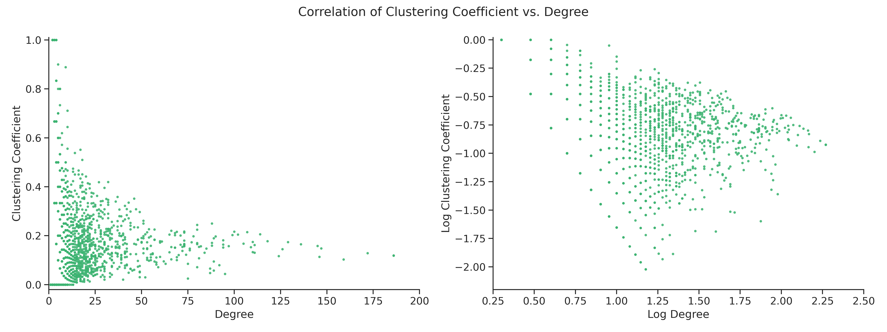

As seen in the examples of the word clouds above there is a clear theme in each of the word clouds. Thus it is possible to identify a main genre that comprises all genres from the community and thus label the community accordingly.

This procedure does however not guranteee that the genre of every artist will be 100% correct.
As the genre of an artist is based on the partitions of the network they will greatly rely on the underlying procedure of constructing the partitions.
Some artist might also make music from different genres which is not accunted for.
For the purpose of our analysis the procedure applied is however needed, and the results of it should thus be assesed with this conditions in mind.

The final network of artists is thus made up of 3098 artists with 17155 collaborations from 8 different genres: _Pop_, _Rock_, _Alternative_, _Hip-Hop_, _Country_, _Reggae_, _Funk-Soul_ and _Punk_.

The visualization shows how the different genre types are mostly grouped together but also that some genres like the _Funk-Soul_ genres is scattered around the network.
The node size is set accordingly to how many other artists the artist is connected to.
It can for example, be observed that several nodes within the _Hip-Hop_ genre appears to be well connected to other artists.
It appears that some genres are better represented than others but it can however be difficult to extract alot of information about the network from the visualization.
The network is thus analysed further.
To begin with lets look at how the nodes are distributed between the genres.

The graph shows, as we expected, that the number of artists is very unbalanced between the 8 genres.
_Hip-Hop_ is for example represented twice as much as _Pop_, which is something that has to be kept in mind through out the analysis.

### Network Density

By looking at the number of nodes and edges, we can obtain the graph density.
The network of study has a low density of just 0.36,
meaning that it has a relatively low number of edges compared to the total number of nodes.

### Clustering Coefficient

To evaluate how interconnected the nodes of the network are,
the average clustering coefficient is calculated. With a low value of 0.122, it indicates that on average the collaborators of an artist do not necessarily collaborate between them.
In fact, 45% of the nodes in the network collaborate with artists that do not collaborate between them.
To understand if there is a relation with the degree, we can plot them together and analyse their correlation:

There is not a clear correlation between the two (correlation coefficient = 0.11).
However, the graph shows that the highest clustering coefficient happens at degrees below 15.
The clustering coefficient was also examined for each genre but no significant pattern was found.

### Centrality

To measure the centrality of the graph we can use the betweenness centrality.
It is based on the network shortest paths and captures how much a given node is in-between others.
To understand it a bit better, we can observe the top most central artists where among we can find:

| Artist         | Betw. Centrality | Degree | Popularity |    Genre    |
| -------------- | :--------------: | :----: | :--------: | :---------: |
| Willie Nelson  |      0.042       |   95   |     76     |    Rock     |
| Paul Oakenfold |      0.029       |   75   |     57     | Alternative |
| Tiësto         |      0.026       |   89   |     75     |     Pop     |
| Pitbull        |      0.019       |   92   |     86     |     Pop     |
| Dolly Parton   |      0.019       |   49   |     86     |   Country   |
| Lil Wayne      |      0.019       |  186   |     86     |   Hip-Hop   |

&nbsp;

It can be observed that the most central nodes are not restricted to one genre or high popularity.
It is interesting to take _Pitbull_ as an example.
_Pitbull_ is an American singer who is especially known for featuring in other artists singles.
In fact _Billboard_ considers him _"the king of collaborations"_ [[ ref ]](https://www.billboard.com/articles/columns/pop/8550769/pitbull-weirdest-collaborations-blake-shelton-michael-jackson).

As an example, the network of the artists the _Pitbull_ collaborates is visualized.
For comparison, similar networks are also visualized for other well-known artists.
