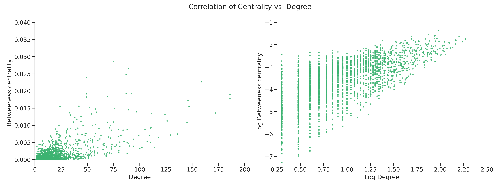

At this stage, we know that _Pitbull_ is a central element but we will need to assess the degree distribution before commenting if he is indeed the _king_. To start understanding how the degree behaves,
we can assess its relation with the centrality.

The graph shows that there is a direct and strong correlation between the two (correlation coefficient = 0.7).
This means that nodes with a higher degree will tend to have a higher betweenness centrality.
To put into the context of the network it means that if an artist collaborates with several other artists he/she will generally also be central in the network.

### Degree Distribution

With our network the degree is especially relevant since the number of collaborations
directly translate to the degree of a node.

The highly skewed histogram, resembles an exponential decay with
high frequencies on low degrees and low frequencies for high degrees.
When looking at the logarithmic transformation, it is possible to see how the scatter plot follows an almost straight line. By calculating the exponent $\gamma$, we can confirm
the network falls in the Scale-Free regime, since $2 < \gamma < 3$. Thus the degree and collaborations between artists follow a _power-law distribution_.
It is not surprising that the collaborations between artists follow a _power-law distribution_,
one would expect that the way artists collaborate should not differ a lot from how scientist collaborate (citations network),
which is a known _power-law_ network [[ref]](https://www.youtube.com/watch?v=myLgzbXxhOQ&feature=emb_title&ab_channel=SuneLehmann).

However, to understand which characteristics the extreme nodes share, it will be interesting to add in our analysis of
collaborations a comparison between the extreme nodes and the rest.
To do so we can make the definition that artists that have 25 or more collaborations are categorized as Top Collaborators.
Marking the barrier at $degree \geq 25$ allows us to have a sample that reaches 10% of the data.
Thus a sample big enough to perform comparisons, while still portraying the behaviour of the top range.
