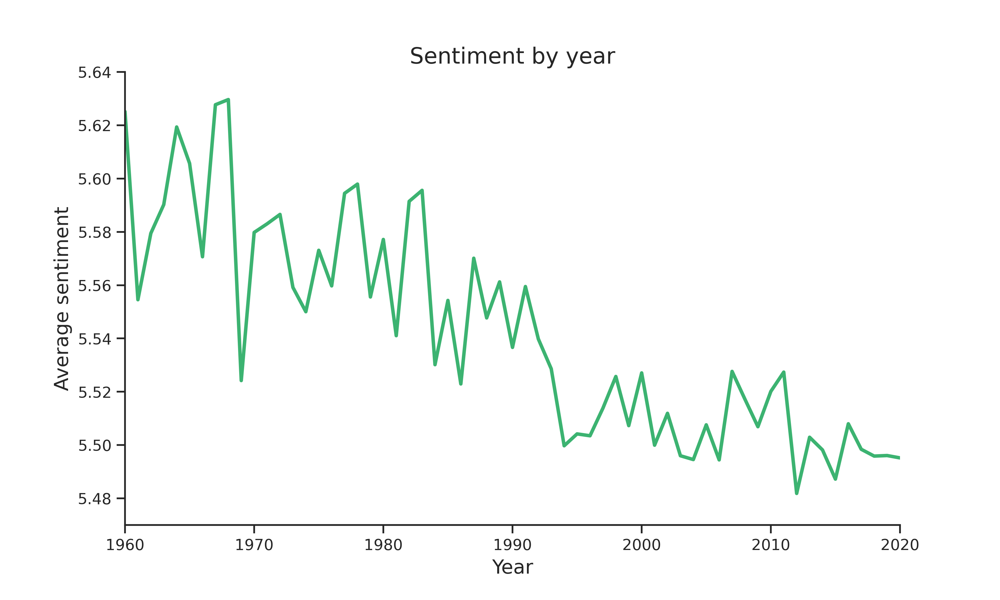

Finally, the sentiment over time can be evaluated to see if the general mood of music has changed over time.
For every year from 1960 to 2020, the average sentiment is therefore calculated.

The plot shows that generally from 1960 to 2020 the sentiment of the songs has been decreasing, meaning that overall the song lyrics have become sadder.
However, during this period, the biggest difference in sentiment has only been 0.15.

One reason for the decrease in sentiment could be due to the increase of _Hip-Hop_ songs after 1990 (as shown in the area plot),
as it was found that this genre also had the lowest average sentiment.
The same explanation can be given for the higher sentiment from 1960 to 1970 as this is where the genre with the highest average sentiment, _Funk-Soul_, is dominant.

Another interesting observation is that during 1969 the average sentiment drops dramatically for one year.
This is the same year the Richard Nixon became the president of the United States of America
and also a time where the protests against the Vietnam War started rising and bands started joining the anti-war movement.
And as most of the songs are American it could therefore be these events are seen in the development of the sentiment.
